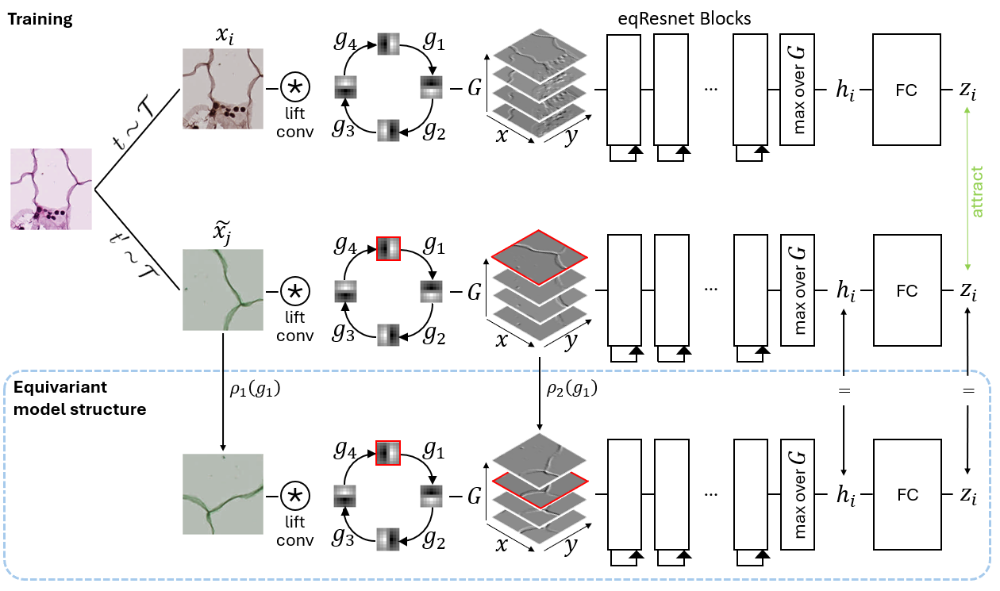

Equivariant SimCLR (eqCLR)
========

This repository contains the code of the master's thesis "Architectural Equivariance for Invariant Contrastive Self-Supervised Learning" that introduces an euqivariant version of SimCLR (eqCLR). The eqCLR self-supervised learning framework combines learnt invariance through conventional augmentations with architectural invariance by employing equivariant group convolutions that achieve through a group pooling an architectural invariance to a chosen symmetry group.


# Installation
Clone this repository:
```
git clone https://github.com/NavidadK/eqCLR
```
Create a conda environment (we used Python 3.11):
````
conda create -n myenv python=3.11
conda activate myenv
pip install -r requirements.txt
````

# Usage
The model implementation can be found in the folder [/eqCLR](/eqCLR/). 

The training and evaluation setup of eqCLR can be found [here](eqclr.py) for eqCLR and the corresponding comparison using conventional SimCLR [here](simclr.py).

To use the hue-equivariance models, the modyfied escnn library must be used ([link](https://github.com/NavidadK/escnn/tree/ssl)).


# Reproducability of Results
In the thesis, we tested four different datasets. Namely, we used the BloodMNIST, PathMNIST and DermaMNIST datasets from the [MedMNIST](https://medmnist.com/) dataset collection and the the [CIFAR10](https://docs.pytorch.org/vision/main/generated/torchvision.datasets.CIFAR10.html) dataset. Those need to be downloaded in a separate /data folder and the needed /results folder need to be initialized to save the results.

The experimnents follow the same experimental setup and evaluation protocol as the files that are linked to in the "Usage" section.

The main experiments can be found in the [/experiments](/experiments/) folder.  The folder contains the ´code for the eqCLR runs for all four datasets. For the remaining datasets only the code for the BloodMNIST data is given but by adjusting the datasets and hyperparameter all other experiments with different datasets and hyperparameters can easily be executed.

The systematic evaluation and visualization of the results can be found in the [/plots](/plots/) folder.